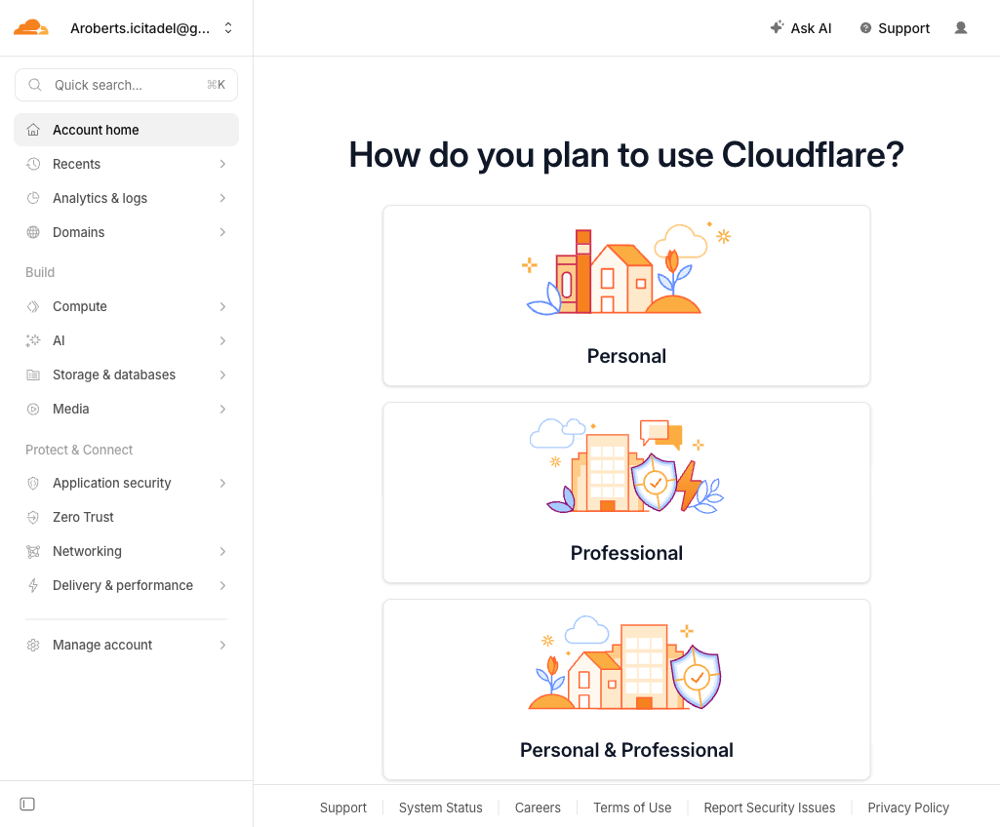
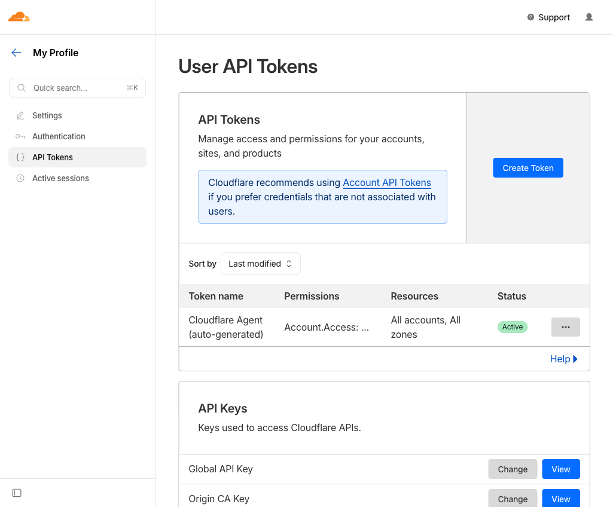
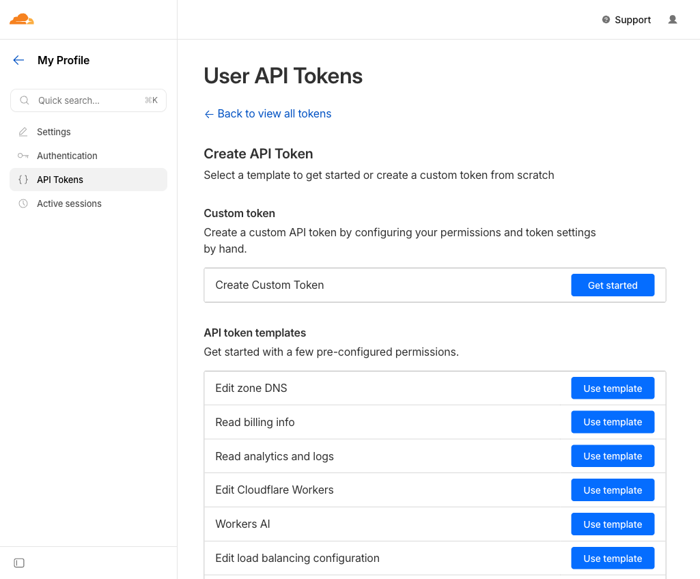
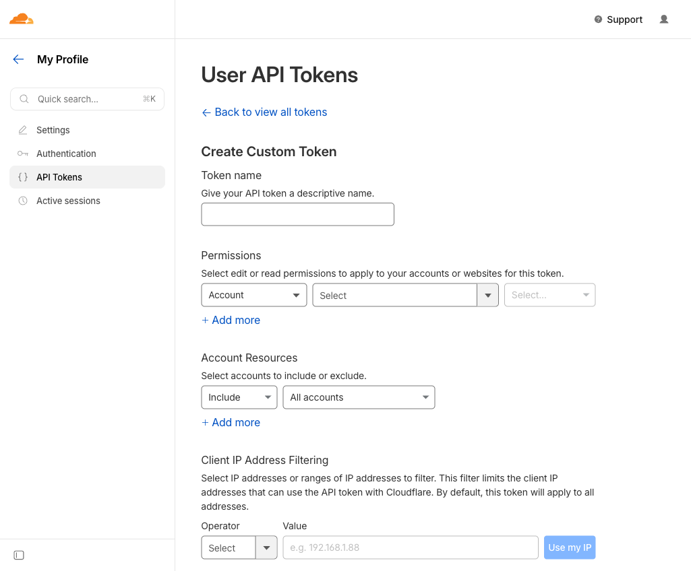
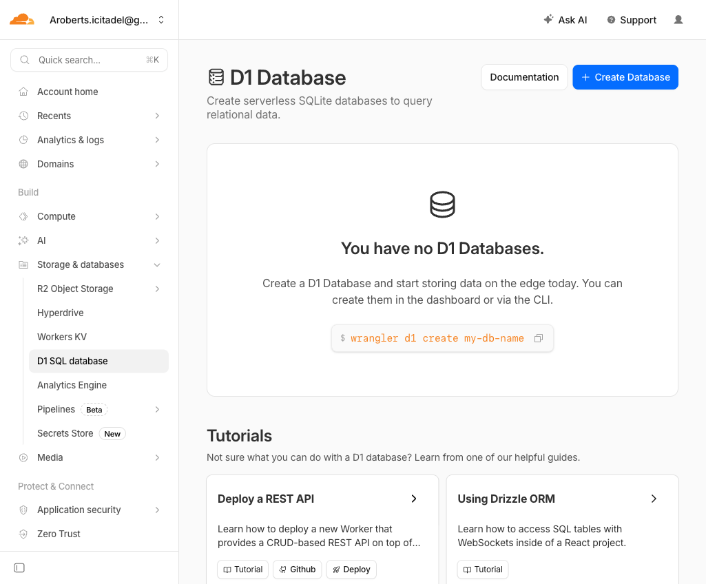
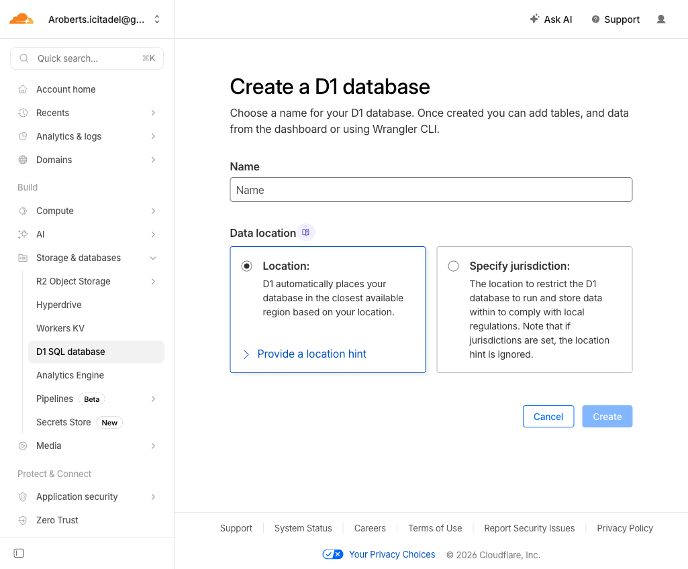
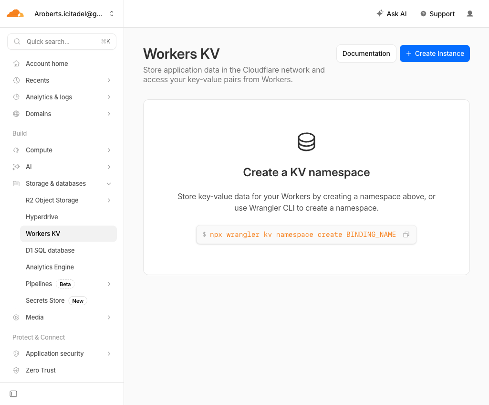
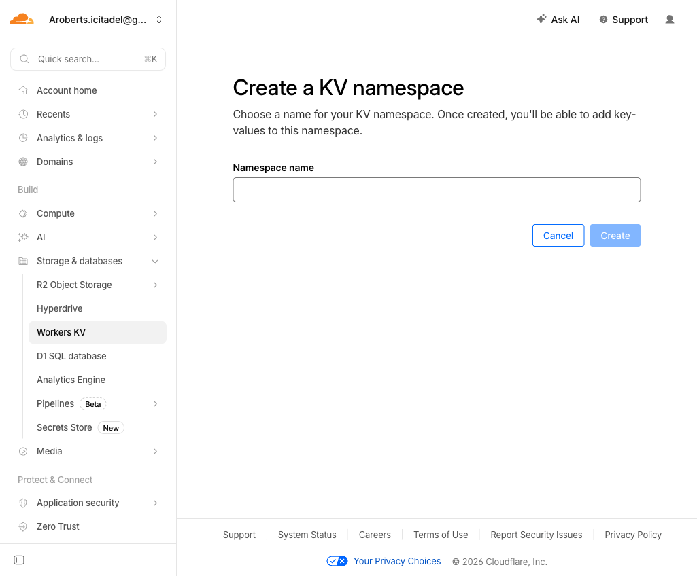
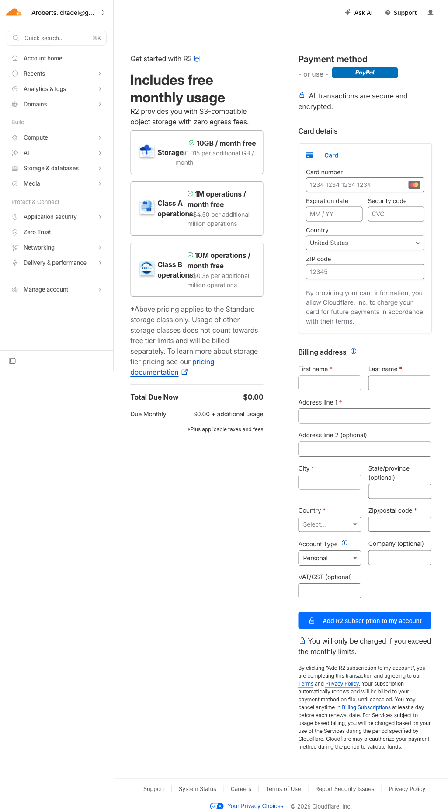

# Cloudflare Integration Test Setup

This guide walks through setting up real Cloudflare resources for running `arni`'s Cloudflare integration tests. You'll need credentials for D1, KV, and R2 — each adapter has its own test suite gated behind an environment variable.

**Estimated time:** 20–30 minutes (mostly R2 billing setup)

---

## Prerequisites

- A Cloudflare account (free tier is fine for D1 and KV)
- A credit or debit card for R2 (required to subscribe, but usage up to 10 GB/month is free)

---

## Step 1: Find your Account ID

Your Account ID appears in the URL of every page in the Cloudflare dashboard:

```
https://dash.cloudflare.com/<ACCOUNT_ID>/...
```



Copy the hex string from the URL — that's your `CLOUDFLARE_ACCOUNT_ID`.

> **Alternative:** Go to **Account home → right-click the URL bar** or navigate to any product page and copy from the URL path.

---

## Step 2: Create a Cloudflare API Token (D1 and KV)

D1 and KV use a **User API token** created from your profile. Go to:

**My Profile → API Tokens** (top-right avatar menu)



Click **Create Token**, then scroll to the bottom and choose **Create Custom Token**.



Fill in the custom token form:



Configure the token as follows:

| Field | Value |
|-------|-------|
| **Token name** | `arni-integration-tests` (or any name) |
| **Permissions — D1** | Account → D1 → Edit |
| **Permissions — KV** | Account → Workers KV Storage → Edit |
| **Account Resources** | Include → your account |

Click **Continue to summary** → **Create Token**. Copy the token value — it is shown only once.

This token value is your `CLOUDFLARE_API_TOKEN`.

---

## Step 3: Create a D1 Database

Navigate to **Storage & databases → D1 SQL database**.



Click **Create Database**.



| Field | Value |
|-------|-------|
| **Name** | `arni-test` (or any name) |
| **Data location** | Location (automatic) — leave default |

Click **Create**. After creation, you'll land on the database detail page. The **Database ID** (a UUID) appears on that page and in the URL:

```
https://dash.cloudflare.com/<ACCOUNT_ID>/workers/d1/databases/<DATABASE_ID>
```

Copy that UUID — it's your `CLOUDFLARE_D1_DATABASE_ID`.

---

## Step 4: Create a KV Namespace

Navigate to **Storage & databases → Workers KV**.



Click **Create Instance**.



| Field | Value |
|-------|-------|
| **Namespace name** | `arni-test` (or any name) |

Click **Create**. After creation, the namespace appears in the list. Click on it — the **Namespace ID** (a UUID) is shown on the detail page and in the URL:

```
https://dash.cloudflare.com/<ACCOUNT_ID>/workers/kv/namespaces/<NAMESPACE_ID>
```

Copy that UUID — it's your `CLOUDFLARE_KV_NAMESPACE_ID`.

---

## Step 5: Set up R2

R2 requires a billing subscription before you can create buckets. The free tier is generous (10 GB/month storage, 1M Class A operations, 10M Class B operations).

### 5a. Subscribe to R2

Navigate to **Storage & databases → R2 Object Storage → Overview**. This redirects to the billing page:



Fill in a payment method and billing address, then click **Add R2 subscription to my account**. You will only be charged if you exceed the free tier limits.

### 5b. Create a Bucket

After subscribing, the R2 overview page loads normally. Click **Create bucket**.

| Field | Value |
|-------|-------|
| **Bucket name** | `arni-test` (or any name — must be globally unique) |
| **Location** | Automatic |

Click **Create bucket**. The bucket name is your `CLOUDFLARE_R2_BUCKET_NAME`.

### 5c. Create R2 API Keys

R2 uses its own access key pair (separate from the User API token above). From the R2 overview page, click **Manage R2 API Tokens** in the top-right.

Click **Create API token**:

| Field | Value |
|-------|-------|
| **Token name** | `arni-integration-tests` |
| **Permissions** | Object Read & Write |
| **Specify bucket** | `arni-test` (or All buckets) |

Click **Create API Token**. Copy both values shown:

- **Access Key ID** → `CLOUDFLARE_R2_ACCESS_KEY_ID`
- **Secret Access Key** → `CLOUDFLARE_R2_SECRET_ACCESS_KEY`

> These are shown only once. Store them somewhere safe.

---

## Step 6: Configure Environment Variables

Export all the credentials before running the integration tests:

```bash
export CLOUDFLARE_ACCOUNT_ID="<your account ID from Step 1>"
export CLOUDFLARE_API_TOKEN="<your User API token from Step 2>"
export CLOUDFLARE_D1_DATABASE_ID="<your D1 database UUID from Step 3>"
export CLOUDFLARE_KV_NAMESPACE_ID="<your KV namespace UUID from Step 4>"
export CLOUDFLARE_R2_ACCESS_KEY_ID="<your R2 access key ID from Step 5c>"
export CLOUDFLARE_R2_SECRET_ACCESS_KEY="<your R2 secret access key from Step 5c>"
export CLOUDFLARE_R2_BUCKET_NAME="arni-test"
```

Or save them to a `.env.test` file (gitignored):

```bash
# .env.test — DO NOT COMMIT
CLOUDFLARE_ACCOUNT_ID=5def4131bcd4c2f86727fd3ba888db1d
CLOUDFLARE_API_TOKEN=...
CLOUDFLARE_D1_DATABASE_ID=...
CLOUDFLARE_KV_NAMESPACE_ID=...
CLOUDFLARE_R2_ACCESS_KEY_ID=...
CLOUDFLARE_R2_SECRET_ACCESS_KEY=...
CLOUDFLARE_R2_BUCKET_NAME=arni-test
```

Load and run:

```bash
set -a && source .env.test && set +a
```

---

## Step 7: Run Integration Tests

Each adapter's tests are gated behind a separate environment variable:

### D1

```bash
TEST_CLOUDFLARE_D1_AVAILABLE=true \
  CLOUDFLARE_ACCOUNT_ID=$CLOUDFLARE_ACCOUNT_ID \
  CLOUDFLARE_API_TOKEN=$CLOUDFLARE_API_TOKEN \
  CLOUDFLARE_D1_DATABASE_ID=$CLOUDFLARE_D1_DATABASE_ID \
  cargo test -p arni --features cloudflare-d1 -- --ignored 2>&1 | grep -E "(test |FAILED|ok$)"
```

### KV

```bash
TEST_CLOUDFLARE_KV_AVAILABLE=true \
  CLOUDFLARE_ACCOUNT_ID=$CLOUDFLARE_ACCOUNT_ID \
  CLOUDFLARE_API_TOKEN=$CLOUDFLARE_API_TOKEN \
  CLOUDFLARE_KV_NAMESPACE_ID=$CLOUDFLARE_KV_NAMESPACE_ID \
  cargo test -p arni --features cloudflare-kv -- --ignored 2>&1 | grep -E "(test |FAILED|ok$)"
```

### R2

```bash
TEST_CLOUDFLARE_R2_AVAILABLE=true \
  CLOUDFLARE_ACCOUNT_ID=$CLOUDFLARE_ACCOUNT_ID \
  CLOUDFLARE_R2_ACCESS_KEY_ID=$CLOUDFLARE_R2_ACCESS_KEY_ID \
  CLOUDFLARE_R2_SECRET_ACCESS_KEY=$CLOUDFLARE_R2_SECRET_ACCESS_KEY \
  CLOUDFLARE_R2_BUCKET_NAME=$CLOUDFLARE_R2_BUCKET_NAME \
  cargo test -p arni --features cloudflare-r2 -- --ignored 2>&1 | grep -E "(test |FAILED|ok$)"
```

### All three at once

```bash
TEST_CLOUDFLARE_D1_AVAILABLE=true \
  TEST_CLOUDFLARE_KV_AVAILABLE=true \
  TEST_CLOUDFLARE_R2_AVAILABLE=true \
  CLOUDFLARE_ACCOUNT_ID=$CLOUDFLARE_ACCOUNT_ID \
  CLOUDFLARE_API_TOKEN=$CLOUDFLARE_API_TOKEN \
  CLOUDFLARE_D1_DATABASE_ID=$CLOUDFLARE_D1_DATABASE_ID \
  CLOUDFLARE_KV_NAMESPACE_ID=$CLOUDFLARE_KV_NAMESPACE_ID \
  CLOUDFLARE_R2_ACCESS_KEY_ID=$CLOUDFLARE_R2_ACCESS_KEY_ID \
  CLOUDFLARE_R2_SECRET_ACCESS_KEY=$CLOUDFLARE_R2_SECRET_ACCESS_KEY \
  CLOUDFLARE_R2_BUCKET_NAME=$CLOUDFLARE_R2_BUCKET_NAME \
  cargo test -p arni --features cloudflare -- --ignored
```

---

## Credential Summary

| Variable | Where to find it | Used by |
|----------|-----------------|---------|
| `CLOUDFLARE_ACCOUNT_ID` | URL bar on any dashboard page | D1, KV, R2 |
| `CLOUDFLARE_API_TOKEN` | My Profile → API Tokens → Create Custom Token | D1, KV |
| `CLOUDFLARE_D1_DATABASE_ID` | D1 database detail page URL | D1 |
| `CLOUDFLARE_KV_NAMESPACE_ID` | KV namespace detail page URL | KV |
| `CLOUDFLARE_R2_ACCESS_KEY_ID` | R2 → Manage R2 API Tokens → Create API Token | R2 |
| `CLOUDFLARE_R2_SECRET_ACCESS_KEY` | (same, shown once at creation) | R2 |
| `CLOUDFLARE_R2_BUCKET_NAME` | Bucket name you chose in Step 5b | R2 |

---

## Notes

- **D1 and KV** use User API tokens (from My Profile), not Account API tokens. The Account API Tokens page (Manage account → Account API tokens) is for a different purpose.
- **R2** uses a separate S3-compatible key pair, not the User API token.
- All resources are free within Cloudflare's free tier limits. The integration tests create and drop small tables/keys, so usage is negligible.
- The test database, namespace, and bucket created here are for testing only — safe to delete afterwards.
